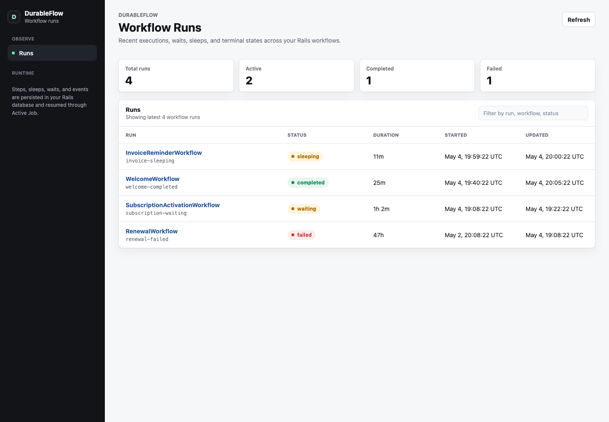
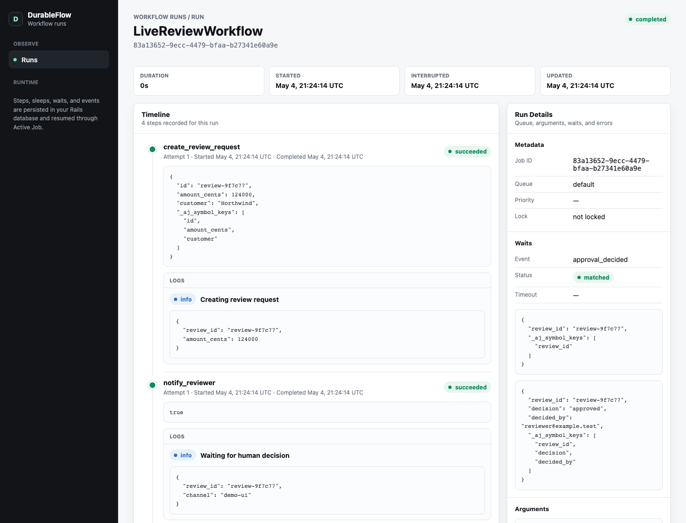
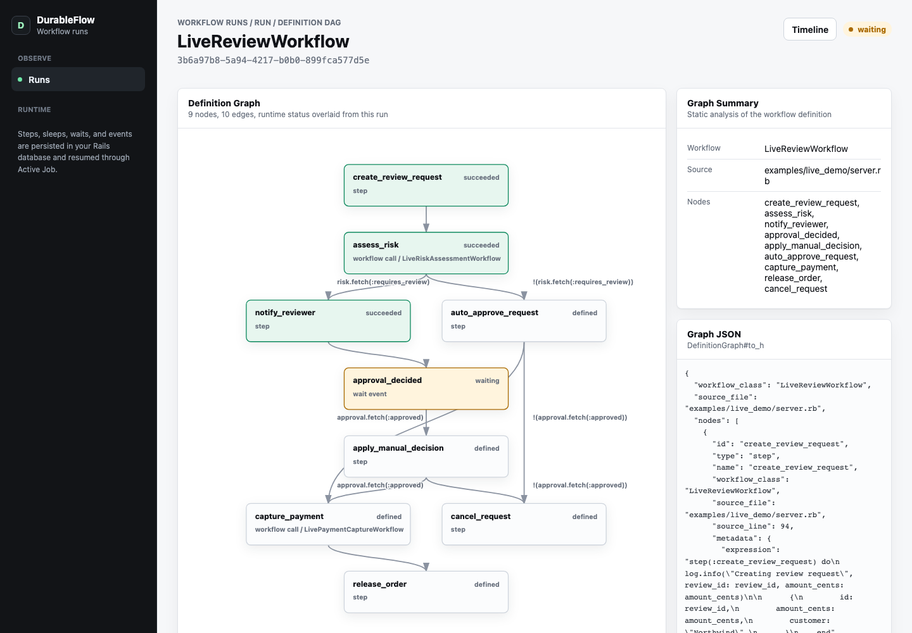

# DurableFlow

DurableFlow is an Inngest-style workflow runtime for Rails, built on `ActiveJob::Continuable`, Active Record, Solid Queue, and `Rails.event`.

It lets you write long-running business workflows as normal Ruby methods. Side effects live in named `step` blocks. Step return values are persisted, so after a crash, deploy, sleep, event wakeup, or retry, the workflow replays from the top and completed steps return their stored values without running again.

```ruby
class WelcomeWorkflow < DurableFlow::Workflow
  def perform(user_id:, trial_id:)
    user = step.run(:load_user) { User.find(user_id) }

    step.run(:send_welcome) { UserMailer.welcome(user).deliver_now }

    step.sleep(:trial_delay, 1.day)

    trial = step.run(:start_trial) { Billing.start_trial!(user, trial_id:) }

    event = step.wait_for_event(:trial_confirmed, timeout: 7.days, match: { trial_id: trial.id })

    step.run(:finalize) { user.update!(onboarded_at: Time.current, confirmed_at: event[:confirmed_at]) }
  end
end
```

The goal is durable, observable workflows without a separate workflow server, Redis dependency, or external control plane.

## Alpha Notice

DurableFlow is alpha software. The API and storage model will likely change as the design is exercised in real applications, and this gem has not yet been used in a production setting.

## UI

DurableFlow ships with a small mountable Rails engine for inspecting workflow runs, definition DAGs, step timelines, waits, workflow logs, arguments, and errors.





Each run detail links to a definition DAG view that statically analyzes the workflow class and overlays runtime status from that run.



## Live Updates

DurableFlow emits committed lifecycle changes for workflow runs, steps, waits, events, and workflow logs. The default broadcaster is a no-op, so live UI is opt-in.

```ruby
# config/initializers/durable_flow.rb
DurableFlow.live_broadcaster = ->(change) do
  next unless change.run_id

  ActionCable.server.broadcast(
    "durable_flow:run:#{change.run_id}",
    change.payload
  )
end
```

Each change includes:

```ruby
change.type           # "workflow_run.updated", "workflow_step.created", "workflow_log.created", ...
change.run_id         # nil for standalone workflow_event.created changes
change.workflow_class
change.record_class
change.record_id
change.record         # Active Record object for in-process renderers
change.snapshot       # small serializable hash
change.payload        # snapshot plus type/run metadata
```

Workflow logs are emitted the same way:

```ruby
step(:create_refund) do
  log.info("Creating refund", refund_id: refund.id)
end

# Broadcasts:
change.type                       # "workflow_log.created"
change.payload.fetch(:level)      # "info"
change.payload.fetch(:message)    # "Creating refund"
change.payload.fetch(:workflow_step_id)
change.record.data_value          # { refund_id: ... } for in-process renderers
```

You can also register subscribers:

```ruby
DurableFlow.on_change do |change|
  Rails.logger.info("[DurableFlow] #{change.type} #{change.run_id}")
end
```

For Turbo Streams, keep authorization in the host app and render whatever partial fits your UI:

```ruby
DurableFlow.live_broadcaster = ->(change) do
  next unless change.run_id

  Turbo::StreamsChannel.broadcast_replace_to(
    "durable_flow:run:#{change.run_id}",
    target: "workflow_run",
    partial: "workflow_runs/live_run",
    locals: { run_id: change.run_id }
  )
end
```

Broadcasts run from `after_commit`, and broadcaster errors are reported but do not fail workflow execution.

## Timeline Data

Use `WorkflowRun#timeline` when building a custom UI. It preloads and groups the run's steps, waits, matched events, and logs so applications do not need to recreate the join logic.

```ruby
run = DurableFlow::WorkflowRun.find_by!(run_id: params[:run_id])
timeline = run.timeline

timeline.step_entries.each do |entry|
  entry.step    # DurableFlow::WorkflowStep
  entry.logs    # logs written inside this step
  entry.waits   # waits created by this step
  entry.events  # events that matched those waits
end

timeline.run_logs # logs written outside a step
timeline.items    # flat chronological items: :step, :wait, :event, :log
```

## Demo App

The repo includes a small live Rails demo app at `examples/live_demo`.

```sh
mise exec ruby@3.4 -- bundle exec ruby examples/live_demo/server.rb
```

Open `http://127.0.0.1:4568/live`, start one or more review workflows, then approve or reject the latest waiting run. The page updates from `DurableFlow.live_broadcaster` using Server-Sent Events and links to the mounted engine UI at `/durable_flow`. Use **Reset demo** to clear the local demo database.

## Status

This is a working prototype targeted at Rails 8.1+ continuation and structured event APIs.

Verified behavior:

- Rails 8.1.3 compatibility.
- Step return-value memoization across replays.
- Dynamic string step names.
- Cursor-based `ActiveJob::Continuable` loops.
- Durable sleep through `perform_later(wait_until:)`.
- Event waits through `Rails.event`.
- Parent workflows waiting for child workflow completion.
- Parent workflows choosing whether child failures raise or return completion payloads.
- Active Job retry/discard handling reflected in workflow and step status.
- Solid Queue `1.1.2` integration.
- Database-backed workflow execution leases to prevent concurrent execution of the same run.
- Opt-in live lifecycle broadcasts through `DurableFlow.live_broadcaster`.
- Explicit workflow logs through `log.info`, `log.warn`, `log.error`, and `log.debug`.

## Install

Use the current GitHub `main` branch:

```ruby
# Gemfile
gem "durable_flow", git: "https://github.com/skorfmann/durableflow.git", branch: "main"
```

For a less moving target, pin a commit SHA with `ref:` instead of `branch:`.

For local development before publishing the gem:

```ruby
# Gemfile
gem "durable_flow", path: "../durableflow"
```

For a published gem:

```ruby
# Gemfile
gem "durable_flow"
```

Then install the tables:

```sh
bundle install
bin/rails generate durable_flow:install
bin/rails db:migrate
```

DurableFlow runs through Active Job. Solid Queue is the recommended adapter:

```ruby
# config/application.rb or config/environments/production.rb
config.active_job.queue_adapter = :solid_queue
```

Mount the optional workflow run viewer:

```ruby
# config/routes.rb
mount DurableFlow::Engine => "/durable_flow"
```

The UI exposes workflow arguments, step results, logs, and errors, so access is denied by default until authentication is configured. Pick one:

```ruby
# config/initializers/durable_flow.rb

# Option 1: HTTP basic authentication.
DurableFlow.ui_http_basic_auth = {
  name: Rails.application.credentials.dig(:durable_flow, :ui_name),
  password: Rails.application.credentials.dig(:durable_flow, :ui_password),
}

# Option 2: Inherit from a controller that enforces your app's authentication.
DurableFlow.ui_base_controller_class = "AdminController"

# Option 3: Explicitly allow unauthenticated access (not recommended outside
# development). You can also restrict access at the routing layer instead,
# for example with a Devise `authenticate` block or route constraint.
DurableFlow.ui_allow_unauthenticated_access = true
```

## Configure

Workflow runs use a database-backed execution lease so concurrent workers do not execute the same run at the same time. The lease is refreshed as steps start and continuations checkpoint.

The default TTL is 10 minutes. Set it longer than your longest single step that does not checkpoint:

```ruby
# config/initializers/durable_flow.rb
DurableFlow.execution_lock_ttl = 15.minutes
```

What that means:

```ruby
step(:sync_big_account) do
  SomeApi.sync_everything(account) # If this can take 25 minutes, use a TTL over 25 minutes.
end
```

If you process records in a cursor loop and call `advance!` or `checkpoint!`, the lease refreshes automatically as the loop progresses:

```ruby
step :sync_accounts, start: 0 do |s|
  Account.find_each(start: s.cursor) do |account|
    SyncAccount.call(account)
    s.advance!(from: account.id)
  end
end
```

## Write a Workflow

Create an application base class if you want shared defaults:

```ruby
# app/workflows/application_workflow.rb
class ApplicationWorkflow < DurableFlow::Workflow
  queue_as :default
end
```

Then write workflows as plain Ruby:

```ruby
# app/workflows/trial_onboarding_workflow.rb
class TrialOnboardingWorkflow < ApplicationWorkflow
  def perform(user_id:, trial_id:)
    user = step(:load_user) { User.find(user_id) }

    step(:send_welcome_email) do
      UserMailer.with(user: user).welcome.deliver_now
      true
    end

    step.sleep(:wait_for_trial_activity, 3.days)

    event = step.wait_for_event(
      :trial_activated,
      timeout: 4.days,
      match: { trial_id: trial_id },
    )

    step(:mark_onboarded) do
      user.update!(onboarded_at: Time.current, onboarding_source: event[:source])
    end
  end
end
```

Start it like any Active Job:

```ruby
TrialOnboardingWorkflow.perform_later(user_id: user.id, trial_id: trial.id)
```

Wake it with a Rails event:

```ruby
Rails.event.notify(:trial_activated, trial_id: trial.id, source: "checkout")
```

For a dense API reference optimized for coding agents, see [docs/llm-reference.md](docs/llm-reference.md).

## Step API

Memoized side-effect step:

```ruby
order = step.run(:create_order) { Order.create!(cart:) }
```

Durable sleep:

```ruby
step.sleep(:retry_tomorrow, 1.day)
step.sleep(:wait_until_send_at, until: campaign.send_at)
step.sleep_until(:wait_until_send_at, campaign.send_at)
```

Wait for a Rails event:

```ruby
event = step.wait_for_event(:payment_received, timeout: 2.days, match: { invoice_id: invoice.id })
```

Use a different event name than the step name:

```ruby
event = step.wait_for_event(:wait_for_charge, event: :stripe_charge_succeeded, match: { charge_id: charge.id })
```

Invoke a child workflow and wait for its result:

```ruby
completion = step.invoke(:send_invoice, SendInvoiceWorkflow, invoice.id, timeout: 1.hour)
```

If child startup needs custom code, return the enqueued job or run id from a block:

```ruby
completion = step.invoke(:send_invoice, timeout: 1.hour) do
  SendInvoiceWorkflow.perform_later(invoice.id, source: "renewal")
end
```

Fan out to child workflows and wait for all of them:

```ruby
completions = step.invoke_each(:send_invoice, invoices, timeout: 1.hour, concurrency: 25) do |invoice|
  step.workflow(SendInvoiceWorkflow, invoice.id, key: invoice.id)
end
```

The block passed to `step.invoke_each` only declares child workflow requests. DurableFlow starts each child inside a named durable step, then waits for matching child completion events. This mirrors Inngest `step.invoke` and Restate workflow calls while keeping Ruby call sites explicit.

For workflows that read better as explicit starts, use the builder form:

```ruby
completions = step.child_workflows(:send_invoices, timeout: 1.hour) do |children|
  invoices.each do |invoice|
    children.workflow(SendInvoiceWorkflow, invoice.id, key: invoice.id)
  end
end
```

If the item itself knows how to start its child workflow, it can provide a stable `workflow_key` and either `perform_later` or `workflow_class` with `workflow_args` / `workflow_kwargs`:

```ruby
class SendInvoiceRequest
  def initialize(invoice)
    @invoice = invoice
  end

  def workflow_key = @invoice.id
  def workflow_class = SendInvoiceWorkflow
  def workflow_args = [ @invoice.id ]
end
```

`step.invoke_each` and `step.child_workflows` start every child in the batch before waiting for the first one. Pass `concurrency:` to process requests in fixed-size batches. Child failures raise `DurableFlow::ChildWorkflowFailedError` in the parent workflow.

If a parent should collect child failures and decide what to do, pass `on_failure: :return`:

```ruby
completions = step.invoke_each(:deliver_invoice, invoices, timeout: 1.hour, on_failure: :return) do |invoice|
  step.workflow(DeliverInvoiceWorkflow, invoice.id, key: invoice.id)
end

failed = completions.select { |completion| completion.fetch("status") == "failed" }
```

The default is `on_failure: :raise`, which fails the parent workflow when a child finishes failed. Returned failure completions include the child run id, status, workflow class, and error fields from the child completion event.

Write structured workflow logs:

```ruby
step.run(:create_refund) do
  log.info("Creating refund", refund_id: refund.id, amount_cents: refund.amount_cents)
  Refunds.create!(refund)
end
```

Logs are persisted with the current workflow run and, when called inside a step, the current workflow step. They also emit `workflow_log.created` live changes.

## Iteration Patterns

Small bounded list: one memoized step per item.

```ruby
item_ids.each do |item_id|
  step("notify-#{item_id}") { Notifier.item_ready(item_id).deliver_now }
end
```

Large cursor loop: one continuation step with cursor checkpoints.

```ruby
step :process_orders, start: 0 do |s|
  Order.pending.find_each(start: s.cursor) do |order|
    ProcessOrder.call(order)
    s.advance!(from: order.id)
  end
end
```

Parallel or high-cardinality work: fan out to child workflows.

```ruby
step.invoke_each(:sync_user, account.users.to_a, timeout: 30.minutes, concurrency: 25) do |user|
  step.workflow(SyncUserWorkflow, user.id, key: user.id)
end
```

## Definition DAGs

DurableFlow can statically analyze a workflow's `perform` method and produce a conservative definition graph from durable primitives:

```ruby
graph = DurableFlow::DefinitionAnalyzer.call(IvwDailyDeliveryWorkflow)
graph.nodes # durable steps, sleeps, waits, calls, fan-out groups
graph.edges # possible execution order, including branch conditions
graph.warnings # dynamic Ruby that could not be represented precisely
```

The analyzer uses Prism and recognizes calls such as `step.run`, `step.sleep_until`, `step.wait_for_event`, `step.invoke`, and `step.invoke_each`. It does not execute workflow code. Ruby branches become conditional edges, fan-out calls become grouped nodes, and dynamic loops with hidden durable steps are reported as warnings.

Runtime timelines remain the source of truth for a specific run; definition DAGs are the static map.

## Rules

- Put side effects inside `step` blocks.
- Keep code outside `step` blocks deterministic and cheap. It runs on every replay.
- Step names must be stable across replays. Use `"notify-#{record.id}"`, not `SecureRandom.uuid`.
- Step return values must be Active Job serializable.
- Steps should still be idempotent where practical. If a process crashes after a side effect runs but before the step result commits, that step can run again.
- Set `DurableFlow.execution_lock_ttl` longer than your longest non-checkpointing step.

## Tables

The install generator creates:

- `durable_flow_workflow_runs`
- `durable_flow_workflow_steps`
- `durable_flow_workflow_events`
- `durable_flow_workflow_waits`
- `durable_flow_workflow_logs`

Step results, workflow arguments, and log data are serialized through Active Job. Event payloads are stored from `Rails.event` notifications and matched against pending waits.

## Testing

Executable examples live in `examples/workflows.rb` and are covered by `test/durable_flow/examples_test.rb`.

DurableFlow also ships test helpers for application test suites:

```ruby
# test/test_helper.rb
require "durable_flow/test_helper"

class ActiveSupport::TestCase
  include DurableFlow::TestHelper

  setup { clear_durable_flow! }
end
```

Example workflow test:

```ruby
class TrialOnboardingWorkflowTest < ActiveSupport::TestCase
  test "waits for trial activation and finishes" do
    freeze_time do
      changes = capture_durable_flow_changes do
        TrialOnboardingWorkflow.perform_later(user_id: users(:ada).id, trial_id: trials(:pending).id)
        perform_durable_flow_jobs(at: Time.current)
      end

      run = durable_flow_run_for(TrialOnboardingWorkflow)

      assert_step_succeeded run, :send_welcome_email
      assert_workflow_sleeping run, step: :wait_for_trial_activity
      assert_durable_flow_change changes, "workflow_run.created"

      travel_to_next_workflow_wake run
      perform_durable_flow_jobs(at: Time.current)

      assert_workflow_waiting_for run, :trial_activated, match: { trial_id: trials(:pending).id }

      resume_workflows_for :trial_activated, trial_id: trials(:pending).id, source: "checkout"

      assert_workflow_completed run
      assert_step_result run, :mark_onboarded, true
      assert_workflow_log run, level: :info, message: "Trial activated"
    end
  end
end
```

Useful helpers include `perform_durable_flow_jobs`, `perform_durable_flow_until_idle`, `resume_workflows_for`, `travel_to_next_workflow_wake`, `durable_flow_run_for`, `durable_flow_timeline_for`, `assert_workflow_completed`, `assert_workflow_sleeping`, `assert_workflow_waiting_for`, `assert_workflow_waiting_for_workflow`, `assert_step_succeeded`, `assert_step_result`, `assert_step_attempts`, `assert_workflow_log`, `assert_step_log`, `capture_durable_flow_changes`, and `assert_durable_flow_change`.

Run the suite against the vendored Rails copy:

```sh
mise exec ruby@3.4 -- bundle exec rake test
```

Run it against released Rails 8.1:

```sh
RAILS_VERSION=8.1.3 mise exec ruby@3.4 -- bundle exec rake test
```

Current suite:

```text
49 runs, 346 assertions, 0 failures, 0 errors, 0 skips
```

## Publishing

Gem releases are published manually from GitHub Actions using pre-1.0 SemVer versions such as `0.1.0`, `0.1.1`, and `0.2.0`.

Open **Actions -> Release gem -> Run workflow**, select `main`, and enter the version to publish.

The workflow validates the `x.y.z` version input, writes that version into `lib/durable_flow/version.rb` inside the CI checkout, runs the test suite, builds the gem, and pushes it to RubyGems.

## Copyable App Prompt

Paste this into Codex, Claude Code, or another coding agent inside a Rails app:

```text
Add DurableFlow workflows to this Rails application.

Use the DurableFlow gem from:
- GitHub main: gem "durable_flow", git: "https://github.com/skorfmann/durableflow.git", branch: "main"
- local path: gem "durable_flow", path: "../durableflow"
- or published gem: gem "durable_flow"

Tasks:
1. Add the gem to the Gemfile and run bundle install.
2. Run bin/rails generate durable_flow:install and migrate the database.
3. Ensure Active Job uses Solid Queue in the relevant environment.
4. Mount DurableFlow::Engine at /durable_flow.
5. Add config/initializers/durable_flow.rb with DurableFlow.execution_lock_ttl set longer than the app's longest non-checkpointing workflow step.
6. Create app/workflows/application_workflow.rb inheriting from DurableFlow::Workflow.
7. Convert this business process into a DurableFlow workflow:
   [Describe the business process here.]
8. Put all side effects inside named step blocks.
9. Use step.sleep for durable delays.
10. Use step.wait_for_event for external callbacks or user actions, and emit matching Rails.event.notify calls from the app code that receives those callbacks.
11. Add log.info/log.warn/log.error calls for important workflow milestones, using structured fields such as model ids, tokens, and external request ids.
12. Add tests using DurableFlow::TestHelper that prove:
    - completed steps do not run twice on replay,
    - sleep resumes correctly,
    - event waits resume only for matching payloads,
    - timeout behavior is explicit.

Important constraints:
- Step names must be stable across replays.
- Step return values must be Active Job serializable.
- Code outside step blocks must be deterministic and cheap.
- Workflow log data must be Active Job serializable.
- If a single step can run longer than DurableFlow.execution_lock_ttl without checkpointing, increase the TTL or split the work into checkpointed chunks.
```

## Copyable Human-in-the-Loop Prompt

DurableFlow does not ship a generic human task system. For most apps, the right implementation depends on your existing users, permissions, admin UI, notifications, and domain models.

Paste this into a coding agent inside your Rails app when a workflow needs a human decision:

```text
Add a human-in-the-loop step to this DurableFlow workflow.

Use app-native Rails models and UI. Do not add a generic DurableFlow task framework.

Workflow:
[Name or paste the workflow here.]

Human decision needed:
[Describe the decision, for example "finance approves or rejects a refund".]

Build this using DurableFlow's existing event wait primitive:
1. Add an app model for the pending decision if one does not already exist. Keep it domain-specific, for example RefundApproval, AccountReview, DeploymentApproval, or KycReview.
2. In the workflow, create that record inside a named step.
3. Pause the workflow with step.wait_for_event, matching on that decision record's id or public token.
4. Add the app UI/controller action that lets an authorized human submit the decision.
5. In that controller action, persist the decision and emit Rails.event.notify with the event name and matching id/token.
6. Resume the workflow and branch on the event payload.
7. Add tests for approve, reject, and timeout paths.

Example shape:

approval = step(:create_refund_approval) { RefundApproval.create!(refund: refund, status: "pending") }

decision = step.wait_for_event(
  :refund_approval_decided,
  timeout: 2.days,
  match: { refund_approval_id: approval.id }
)

Controller completion should emit:

Rails.event.notify(
  :refund_approval_decided,
  refund_approval_id: approval.id,
  decision: "approved",
  decided_by_id: Current.user.id
)

Constraints:
- Use the app's existing authentication and authorization.
- Use a public token instead of a sequential database id for public links or external callbacks.
- Keep the decision record domain-specific and easy to query from the app's admin UI.
- Put workflow side effects inside named step blocks.
```

## What It Is Not

DurableFlow is not trying to replace Temporal or Inngest Cloud. It is an in-app Rails workflow runtime for teams that want durable, observable, multi-step business logic while staying inside Rails, Active Job, and their database.
